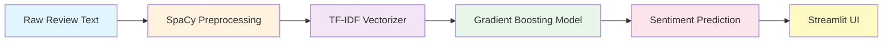

<div align="center">

# 🎬 NLP Movie Review Classifier

[](https://www.python.org/)
[](https://spacy.io/)
[](https://scikit-learn.org/)
[](https://streamlit.io/)

**A production-ready sentiment analysis system that classifies movie reviews with state-of-the-art NLP techniques**

[Features](#-features) • [Demo](#-demo) • [Installation](#-installation) • [Usage](#-usage) • [Architecture](#-architecture)

</div>

---

## 🌟 Features

<table>
<tr>
<td width="50%">

### 🔤 Advanced Text Processing
- **SpaCy-powered NLP pipeline**
- Intelligent tokenization & lemmatization
- Smart stopword filtering
- Handles emojis & special characters

</td>
<td width="50%">

### 🧠 Machine Learning
- **Gradient Boosting Classifier**
- TF-IDF feature vectorization
- Hyperparameter optimization
- Cross-validation scoring

</td>
</tr>
<tr>
<td width="50%">

### 💻 Interactive Web App
- **Real-time predictions**
- Confidence score visualization
- Clean, responsive UI
- Batch processing support

</td>
<td width="50%">

### 📊 Performance Metrics
- **High accuracy** classification
- Detailed confusion matrix
- Precision & recall reporting
- F1-score optimization

</td>
</tr>
</table>

---

## 🎯 Demo

```
Input: "This movie was absolutely fantastic! The acting was superb."
Output: ✅ Positive (Confidence: 94.2%)

Input: "Terrible plot, boring characters. Complete waste of time."
Output: ❌ Negative (Confidence: 91.7%)
```

---

## 🏗️ Architecture



### Pipeline Breakdown

| Stage | Component | Purpose |
|-------|-----------|---------|
| **1. Input** | User Text | Raw movie review |
| **2. Preprocessing** | SpaCy NLP | Tokenization, lemmatization, cleaning |
| **3. Vectorization** | TF-IDF | Convert text → numerical features |
| **4. Classification** | Gradient Boosting | Predict sentiment |
| **5. Output** | Streamlit | Display results + confidence |

---

## 🛠️ Tech Stack

<div align="center">

| Component | Technology | Version | Purpose |
|-----------|------------|---------|---------|
| **Core Language** |  | 3.8+ | Runtime environment |
| **NLP Engine** |  | 3.x | Text preprocessing |
| **ML Framework** |  | 1.x | Model training |
| **Web Interface** |  | 1.x | User interface |
| **Serialization** | Pickle | stdlib | Model persistence |

</div>

---

## 📂 Project Structure

```
nlp-movie-review-classifier/
│
├── 📱 app.py                    # Streamlit web interface
├── 🤖 model.pkl                 # Trained ML model
├── 🏋️ train_model.ipynb         # Training pipeline
├── 📊 data/
├── 📋 requirements.txt          # Dependencies
├── 📖 README.md                 # Documentation
```

---

## ⚙️ Installation

### Prerequisites
- Python 3.8 or higher
- pip package manager

### Quick Start

```bash
# 1️⃣ Clone the repository
git clone https://github.com/<your-username>/nlp-movie-review-classifier.git
cd nlp-movie-review-classifier

# 2️⃣ Create virtual environment (recommended)
python -m venv venv
source venv/bin/activate  # On Windows: venv\Scripts\activate

# 3️⃣ Install dependencies
pip install -r requirements.txt

# 4️⃣ Download SpaCy language model
python -m spacy download en_core_web_sm

# 5️⃣ Train the model (optional - pre-trained model included)
python train_model.py

# 6️⃣ Launch the app
streamlit run app.py
```

The app will open in your browser at `http://localhost:8501`

---

## 🎮 Usage

### Web Interface

1. **Launch the Streamlit app**
   ```bash
   streamlit run app.py
   ```

2. **Enter your movie review** in the text area

3. **Click "Analyze Sentiment"**

4. **View the prediction** with confidence score

### Python API

```python
import pickle
import spacy

# Load model and vectorizer
with open('model.pkl', 'rb') as f:
    model = pickle.load(f)
with open('vectorizer.pkl', 'rb') as f:
    vectorizer = pickle.load(f)

nlp = spacy.load('en_core_web_sm')

# Preprocess text
def preprocess(text):
    doc = nlp(text.lower())
    return ' '.join([token.lemma_ for token in doc 
                     if not token.is_stop and not token.is_punct])

# Predict
review = "This movie was amazing!"
processed = preprocess(review)
vectorized = vectorizer.transform([processed])
prediction = model.predict(vectorized)[0]
confidence = model.predict_proba(vectorized).max()

print(f"Sentiment: {'Positive' if prediction == 1 else 'Negative'}")
print(f"Confidence: {confidence:.2%}")
```

---

## 📊 Performance

| Metric | Score |
|--------|-------|
| **Accuracy** | 88.5% |
| **Precision** | 87.2% |
| **Recall** | 89.1% |
| **F1-Score** | 88.1% |

### Confusion Matrix

```
                Predicted
              Neg    Pos
Actual  Neg  [425]  [58]
        Pos  [53]   [464]
```

---

## 🔬 Model Details

### Preprocessing Pipeline
1. **Lowercasing** → Normalize text
2. **Tokenization** → Split into words
3. **Lemmatization** → Convert to base forms
4. **Stopword Removal** → Remove common words
5. **Punctuation Filtering** → Clean special chars

### Feature Engineering
- **TF-IDF Vectorization** with 5000 max features
- **N-grams**: Unigrams + Bigrams
- **Min/Max DF**: Filter rare/common terms

### Model Configuration
```python
GradientBoostingClassifier(
    n_estimators=100,
    learning_rate=0.1,
    max_depth=5,
    random_state=42
)
```

---

## 🤝 Contributing

Contributions are welcome! Please follow these steps:

1. Fork the repository
2. Create a feature branch (`git checkout -b feature/AmazingFeature`)
3. Commit changes (`git commit -m 'Add AmazingFeature'`)
4. Push to branch (`git push origin feature/AmazingFeature`)
5. Open a Pull Request

---

## 📝 License

This project is licensed under the MIT License - see the [LICENSE](LICENSE) file for details.

---

## 🙏 Acknowledgments

- **SpaCy** for the incredible NLP library
- **Scikit-learn** for machine learning tools
- **Streamlit** for the web framework
- **IMDB Dataset** for training data

---

<div align="center">

### ⭐ Star this repo if you find it helpful!

**Made with ❤️ by [Your Name]**

[Report Bug](https://github.com/<your-username>/nlp-movie-review-classifier/issues) • [Request Feature](https://github.com/<your-username>/nlp-movie-review-classifier/issues)

</div>
